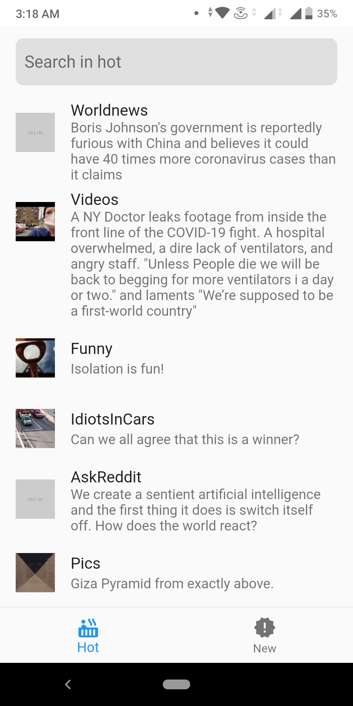
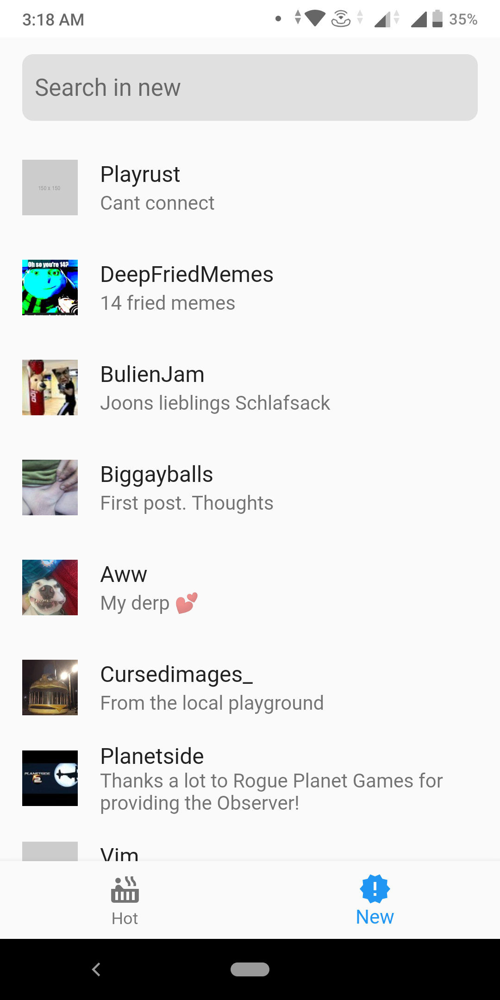
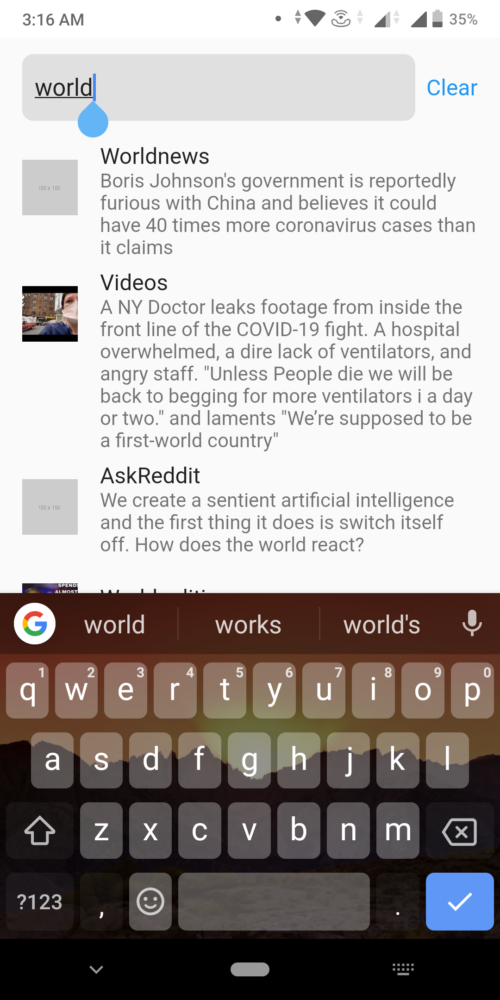

# Newtastic

Flutter App for New and Hot posts using reddit api
[Hot Posts](https://www.reddit.com/hot.json)
[New Posts](https://www.reddit.com/new.json)

##App Screenshots

###Download the app
https://drive.google.com/open?id=16FLldroL_iFJ4ua-6MgNxGZ3H-4RKqTu

## Getting Started

This project is a starting point for a Flutter application.

A few resources to get you started if this is your first Flutter project:

- [Lab: Write your first Flutter app](https://flutter.dev/docs/get-started/codelab)
- [Cookbook: Useful Flutter samples](https://flutter.dev/docs/cookbook)

For help getting started with Flutter, view our
[online documentation](https://flutter.dev/docs), which offers tutorials,
samples, guidance on mobile development, and a full API reference.
